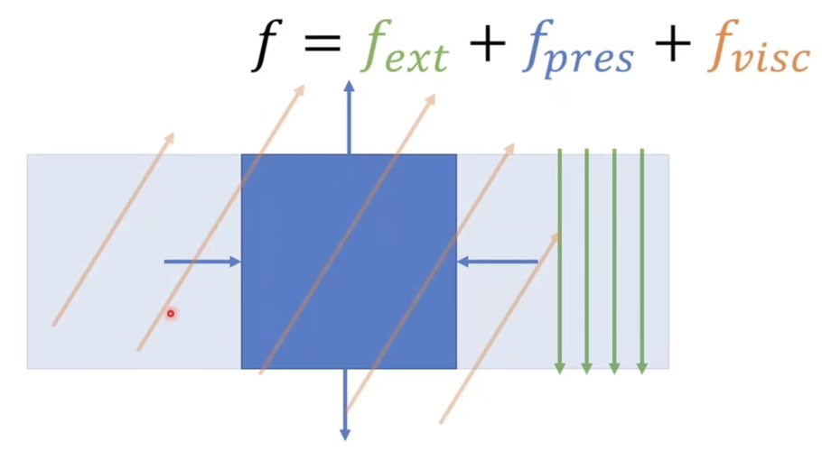

# 流体仿真CFD

## 流体仿真中的受力

如下图，看一下流体中的一小个区域，它的受力有：

- 外力：例如重力
- 压力：周围区域对该区域产生的压强
- 粘性力：周围区域对该区域产生的“剪切力”，迫使区域和它们有相同的运动趋势

## 可压缩性

流体仿真里面有可压缩流体和不可压缩流体的仿真，它们使用了不同的方法（公式）来模拟逼近压缩和不可压缩的效果。但它们都离不开Navier-Stokes方程。

## Navier-Stokes方程

纳维-斯托克斯方程的公式如下：

$\displaystyle\frac{Dv}{Dt}=-\frac{1}{\rho}\nabla p+\nu\nabla^2v+f_{ext},\quad \nabla\cdot v=0$

公式的含义如下：

$\nabla$ 是向量微分算子，$\nabla=\left [\displaystyle\frac{\partial}{\partial x},\frac{\partial}{\partial y}, \frac{\partial}{\partial z}\right ]$

$\nabla^2$ 是拉普拉斯算子，是梯度的散度，表达的是“扩散能有多快”，或者想像成“与周围的量要保持趋同”。

$\displaystyle\frac{Dv}{Dt}$ 是材料导数，$v(x,t)$是粒子关于位置和时间的速度，是一个惯性项

$-\displaystyle\frac{1}{\rho}\nabla p$ 是压力项，只看公式的话，则是“一个物体受到的力，和它压力的梯度大小相反”。可以想像成，当粒子在空间中分布的压力$p$的变化曲线“越陡”，压力梯度的值越大，则粒子就越会朝着相反的方向“被挤开”。一个简单的例子，当粒子从压力小的地方朝着压力高的地方运动，此时$\nabla p$是个正数（斜率为正），那么粒子就会倾向于“往回弹”。关于$p$，使用不同的求解方法，$p$有不同的表达。一般来说可以表达为$p=k(\rho-\rho_0)$，$\rho_0$是初始的密度，压力和密度线性相关。公式的意思是，当$\rho$密度小于初始密度$\rho_0$时，压强$p$是个负数，想像成粒子有被从密度高的地方往密度低的地方“推回去”的趋势（或者是低压力的地方“吸引”其他粒子过来）；而当$\rho$密度大于初始密度$\rho_0$时，压强$p$是个正数，想象成粒子所处的高密度地区，有一个被“推往”低密度地方的“推力”。但是，$\rho$往往是个未知量，方程不好解。

$\nu\nabla^2v$ 是粘性项，对应上述粘性力。形象地说，当一个粒子在运动时会保持和它邻居运动方向一样趋势的一个力。$\nu=\displaystyle\frac{\mu}{\rho_0}$，其中$\mu$是剪切模量（固体）/ 动态粘度（液体）

$f_{ext}$ 是外力项，根据具体场景有所不同

$\nabla\cdot v=0$ 速度的散度为零表示流入和流出的速度没有变化，即液体没有压缩（不可压缩液体）。解释：$\nabla\cdot v=\displaystyle\frac{\partial v}{\partial x}+\frac{\partial v}{\partial y}+\frac{\partial v}{\partial z}$，其中每一项偏微分代表一个微小体积在该方向上的速度变化。以$x$方向为例，如果$\displaystyle\frac{\partial v}{\partial x}>0$，则粒子在该微小体积内在$x$方向上流出的速度大于流入的速度，液体就“膨胀”了；相反，如果$\displaystyle\frac{\partial v}{\partial x}<0$，则流出速度比流入速度小，粒子在该体积内被“压缩”了。然而，$\displaystyle\frac{\partial v}{\partial x}+\frac{\partial v}{\partial y}+\frac{\partial v}{\partial z}=0$ 并不一定需要每一项都为零，比如可以是$x$方向小了，但$y$方向大了，整体为零即可。整体为零意味这液体在这个微小体积内整体的速度不变，即没有被压缩。

## 流体仿真步骤

基于算子分裂法的流体仿真步骤

1. 忽略压力项，求解一个估计的速度$v^*$，公式为$\displaystyle\frac{Dv^*}{Dt}=\nu\nabla^2v^*+f_{ext}$，也可以理解为根据$v_n$先求得$v_{n+0.5}$：

   - 求解：$dv=g+\nu\nabla^2v_n$

   - 更新：$v_{n+0.5}=v_n+\Delta tdv$

2. 根据不可压条件$\nabla\cdot v= 0$ 或者$\displaystyle\frac{D\rho}{Dt}$计算$p$

3. 通过$\displaystyle\frac{Dv}{Dt}=-\frac{1}{\rho}\nabla p$ 修正估计速度$v^*$，也叫投影/压力求解器，可以理解为根据$v_{n+0.5}$求得最终需要的$v_{n+1}$

   - 求解：$dv=-\displaystyle\frac{1}{\rho}\nabla(k(\rho-\rho_0))$ 以及$\displaystyle\frac{D\rho}{Dt}=\nabla\cdot (v_{n+0.5}+v_n)=0$ 

   - 更新：$v_{n+1}=v_{n+0.5}+\Delta tdv$

4. 根据速度更新位置信息$\displaystyle\frac{Dx}{Dt}=v$，更新泊松：

   - 更新：$x_{n+1}=x_n+\Delta tv_{n+1}$

这种方式叫算子分裂法。还有另一个名字叫投影法（advection-projection），因为是在先求得一步“不对”的$v$之后，再将结果投影回来求得正确结果。

## 弱可压缩流体

弱可压缩流体的思路：

对于弱可压缩流体，可以不考虑这一项$\nabla\cdot v=0$

而只考虑：$\displaystyle\frac{Dv}{Dt}=-\frac{1}{\rho}\nabla p+\nu\nabla^2v+f_{ext}$

离散：$\displaystyle\frac{dv_i}{dt}=g-\frac{1}{\rho}\nabla p(x_i)+\nu\nabla^2 v(x_i)=a_i$

更新速度：$v_i=v_i+\Delta ta_i$

更新位置：$x_i=x_i+\Delta tv_i$

但是，如何求得$\rho_i, \nabla p(x_i), \nabla^2v(x_i)$？

## 学习资料

- [太极图形课S1第10讲：流体仿真 01](https://www.bilibili.com/video/BV1mi4y1o7wz?p=1&vd_source=b81ee13afebc577ab303e9f3baf5c0ed)
- [SPH算法 1 理论学习](https://www.bilibili.com/video/BV1mg411y7i9/?p=9&spm_id_from=333.880.my_history.page.click&vd_source=b81ee13afebc577ab303e9f3baf5c0ed)
- 