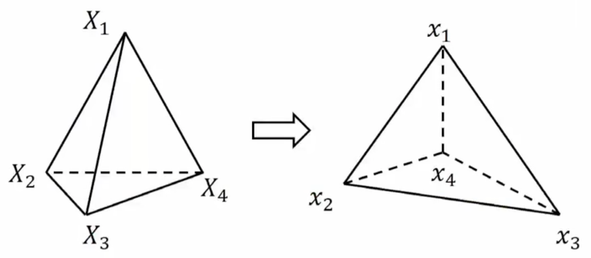

# 线性有限元

> 注意：该方法并非工程中的FEM方法

## 目标

- 理解图形学中线性有限元的理论部分

## 1. 时间离散化

省略...

## 2. 空间离散化

空间离散化方法：

- 弹簧质点系统
- 线性有限元

### 2.1 弹簧质点系统

是一种方法...(链接)

### 2.2 线形有限元

#### 2.2.1 概念符号

---

$\Phi - Deformation\;Map - 形变映射$

$F - Deformation\;Gradient - 形变梯度$ 

$\varepsilon - Deformation\;tensor - 形变张量$ 

​	0代表没有任何形变，不等于0代表由形变

$\Psi(\varepsilon(F)) - Energy\;Density - 能量密度$

​	用张量定义的能量密度，有张量就有能量密度，没有张量就没有能量密度

​	可以认为是张量的平方，或者是保体积的项

$E = \int \Psi - 对能量密度求积分$

$f = - \frac{\partial E}{\partial x} - 对位置求导$

$P -  Piola-Kirchhoff\;stress\;tensor - 能量密度\Psi对形变梯度F求导$

---

#### 2.2.2 形变映射

$x = \phi(X)$ 这里$\phi$映射的意思是将*初始位置*$X$映射成为*当前位置*$x$

**平移映射**
$$
\phi(X) = IX + t
\\
\\
I = \left[
\begin{matrix}
1&0\\
0&1
\end{matrix}
\right]
$$

**旋转映射**
$$
\phi(X) = RX
\\
\\
R = \left[
\displaystyle\begin{matrix}
cos(\theta)&-sin(\theta)\\
sin(\theta)&cos(\theta)
\end{matrix}
\right]
$$

**拉伸映射**
$$
\phi(X) = SX
\\
\\
S = \left[
\begin{matrix}
2&0\\
0&1
\end{matrix}
\right]
$$

**微元的思路**

设微元的中心为$X^*$，微元中的另外一点为$X$

对于这个接近$X^*$的点$X$，它的形变映射是什么样子？
$$
\phi(X) \approx \displaystyle\frac{\partial \phi}{\partial X}(X-X^*) + \phi(X^*) = \frac{\partial \phi}{\partial X} + (\phi(X^*) - \frac{\partial \phi}{\partial X}X^*)
$$
对$X$进行泰勒一介展开，然后化简成和$X$有关的、以及和$X^*$有关的部分，则
$$
\phi(X) \approx FX + t
\\
\\
F - Deformation\;gradient - 形变梯度
$$
也就是，在很小很小的微元范围内，形变映射可以近似为一个*仿射变换*。

在上面的映射变换例子中

- **平移映射**的$F$为$I$单位矩阵

- **旋转映射**的$F$为旋转矩阵$R$
  $$
  F = \displaystyle\frac{\partial \phi}{\partial X} = R = \left[
  \begin{matrix}
  cos(\theta)&-sin(\theta)\\
  sin(\theta)&cos(\theta)
  \end{matrix}
  \right]
  $$

- **拉伸映射**的$F$为拉伸矩阵S
  $$
  F = \displaystyle\frac{\partial \phi}{\partial X} = S = \left[
  \begin{matrix}
  2&0\\
  0&1
  \end{matrix}
  \right]
  $$

#### 2.2.3 能量密度

**公式推导**：

这个公式$\Psi(x) = \Psi(\phi(X))$表示的意思是$x=\phi(X)$这个点的能量密度函数

前面根据泰勒一介展开得到的近似：$\phi(X) \approx FX+t$

于是，$\Psi(x) \approx \Psi(FX+t)$

然后，有限元的能量和平动$t$没有什么关系，所以$\Psi(x) \approx \Psi(FX)$

接着，$X$是一个和状态无关的量，因为定义中$x$代表当前位置，$X$代表初始位置，所以$\Psi(x) \approx \Psi(F)$

所以，能量密度$\Psi(x)$可以定义成只和形变梯度$F$有关的一个公式

**能量密度定义**：

例如：$\Psi(F) = \displaystyle\frac{1}{2}k||F-I||_F^2$表示的是任何非单位矩阵$I$作为形变梯度，都会造成能量的变化。看似很合理，但是，旋转形变也会引起能量变化，不是所期待的。

在例如：$\Psi(F) = \displaystyle\frac{1}{2}k||F||_F^2$表示是旋转不会产生能量，但是...

怎么描述也不够，所以需要引入一个新的量$\varepsilon$来描述形变，应变张量$\varepsilon$

**应变张量定义：**

$\varepsilon(F)$应变张量定义需要是：

1. $\varepsilon$描述的是形变的严重程度
2. $\varepsilon(I)=0$ 表示初始状态下的应变需要为0
3. $\varepsilon(F)=\varepsilon(RF)$ 表示旋转形变不产生应变

根据这个定义，可以用给应变张量的**本构模型(constitutive model)**有：

- St. Venant-Kirchhoff模型：$\varepsilon(F)=\frac{1}{2}(F^TF-I)$
- Co-rotated线形模型：$\varepsilon(F)=S-I, where\;F=RS$
  - 做**极分解(Polar Decomposition)**
  - $R$是一个旋转矩阵
  - S是一个对称矩阵

结论，能量密度可以定义成应变$\varepsilon$的平方

$\Psi(\varepsilon)=\displaystyle\frac{1}{2}k||\varepsilon||_F^2$，没有应变=没有能量；有应变=有能量

$\Psi(\varepsilon)=\mu||\varepsilon||_F^2 + \displaystyle\frac{\lambda}{2}tr(\varepsilon)^2$ - 除了应变的平方外（保硬度的），还加了应变trace的平方（保体积的）

#### 2.2.4 从能量密度到能量

能量等于能量密度**对整个物体**求积分$E(x) = \int_{\Omega}\Psi(F)dX$，但这是对**连续空间(Continuous Space)**的，需要空间离散化，即线形有限元Linear FEM

**空间离散化** Spatial Discretation

有了有限元离散化以后，对连续空间的积分，则可以变成对离散空间各个Element的求。再在每个Element的内部对能量密度求积分：

$E(x) = \sum_{e_i}\int_{\Omega_{e_i}}\Psi(F_i(x))dX = \sum_{e_i}w_i\Psi(F_i(x))$

$w_i = \int_{\Omega_{e_i}}dX$ 为“在这个空间中，对自己求积分，即等于这个空间（这个Element）的面积。在三维空间中，$w_i$则表示体积。

> 类似与求质量：如果密度是均质的，那么密度 x 体积 = 质量，
>
> 如果能量密度是均质的，那么能量密度 x 体积 = 能量。

#### 2.2.5 三维线形元的例子

**求形变梯度**$F$

有两个四面体，每个四面体有四个点，从左边的状态形变到右边的状态，根据线形元的公式$\phi(x)=FX+t$，则有：
$$
x_1=FX_1+t\qquad (1)
\\
x_2=FX_2+t\qquad (2)
\\
x_3=FX_3+t\qquad (3)
\\
x_4=FX_4+t\qquad (4)
$$

为了求形变梯度$F$，使用$(1), (2), (3)$式减去$(4)$式，可以消除平动$t$，然后得到：
$$
[x_1-x_4 \quad x_2-x_4 \quad x_3-x_4] = F[X_1-X_4 \quad X_2-X_4 \quad X_3-X_4]
\\
\\
D_s和D_m
$$
于是，求得形变梯度为$F=D_sD_m^{-1}$

那么，当$D_m$不为0时，可以求出任何事后的形变梯度$F$

> 求形变梯度$F$的目的，是求能量，进而求力。

**求能量密度**

> 能量对位置的导数，力；
>
> 能量密度对位置的导数，**力的密度**

所以，使用链式法则求导：
$$
\frac{\partial \Psi}{\partial x}=\frac{\partial F}{\partial x}:\frac{\partial \Psi}{\partial F}
$$
形变梯度对位置的导数，$\frac{\partial F}{\partial x}$，在2D中，是一个$(2n\times1)\times(2\times2)$的张量，其中

- $(2n\times1)$是位置的向量（两个n）
- 形变梯度$F$是一个$(2\times2)$的矩阵
- 结果是一个$(2n\times1)$的向量

链式求导的左边一项是： 如果位置$x$产生扰动，就会对形变梯度$F$产生扰动。形变梯度$F$会有什么变化？

链式求导的右边一项是：如果形变梯度$F$有一个扰动，能量密度$\Psi$会有什么变化？

> 这里看的是，在位置$x$产生非常非常小的变动的时候，能量密度是怎么变化的

上面的公式中，$\displaystyle\frac{\partial \Psi}{\partial F}$单独拎出来，叫做1st Piola-Kirchhoff stress tensor，PK1应力？

> 这个PK可以理解为，在张量空间的力是什么样的

## 问题

- 工程中的FEM区别？
- 把代码也拎进来

## 学习资料

- [太极图形课S1第08讲：弹性物体仿真 01](https://www.bilibili.com/video/BV1eY411x7mK/?spm_id_from=333.999.0.0&vd_source=b81ee13afebc577ab303e9f3baf5c0ed)
- [太极图形课S1第09讲：弹性物体仿真 02](https://www.bilibili.com/video/BV1nr4y1Q73e/?spm_id_from=333.999.0.0&vd_source=b81ee13afebc577ab303e9f3baf5c0ed)