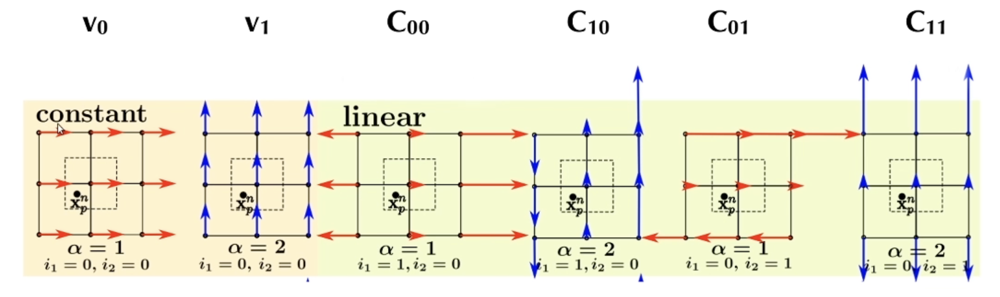
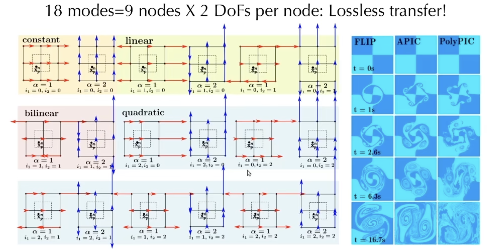
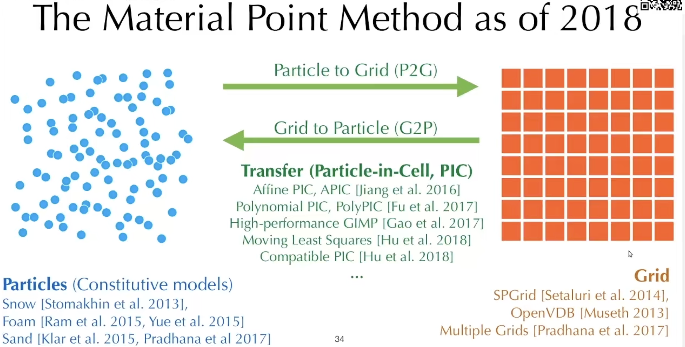

# 物质点法MPM

## 目标

- 了解MPM相关知识点

- 解读Taiji中[mpm88.py](https://github.com/taichi-dev/taichi/blob/master/python/taichi/examples/simulation/mpm88.py):fontawesome-solid-code:代码

## 1. 混合拉格朗日-欧拉方法

### 1.1 方法概览

Particle advection schemes:

- Particle-in-Cell (PIC), Affine Particle-in-Cell (APIC), Polynomial PIC (PolyPIC)
- Fluid Implicit Particles (FLIP)

Material Point Method (MPM), Moving Least Squares MPM (MLS-MPM)

- Constutive models in MPM
- Lagrangian forces in MPM
- Implicit MPM

### 1.2 方法一般流程

在混合拉格朗日-欧拉方法中，粒子是一等公民，网格是用来做计算和存储状态的。

1. Particle-to-Grid transfer (P2G)
2. Grid operations
   - Pressure projection
   - Boundary conditions
3. Grid-to-Particle transfer (G2P)
4. Particle operations
   - Move particles
   - Update material

### 1.3 欧拉网格vs拉格朗日粒子

|      | 欧拉网格 Eulerian Grids                    | 拉格朗日粒子 Lagrangian Particles                            |
| ---- | ------------------------------------------ | ------------------------------------------------------------ |
| <+>  | Good at projection                         | Good at advection                                            |
| <+>  | Easy to discrete                           | Low dissipation                                              |
| <+>  | 查找邻居很高效 Efficient neighbour look-up |                                                              |
| <+>  | Easy to precondition                       |                                                              |
| <->  | Dissipative: loss of energy and geometry   | 做离散化很麻烦 Tricky to discrete                            |
| <->  |                                            | 查找邻近粒子算法复杂 Complex algorithm for neighbour look-up |

## 2. PIC

做P2G时，粒子并不会同等地对待附近的网格，而是取决于权重。一般权重的做法就是用核函数。

核函数的例子：

- B-Spline kernels
  - Linear 线性插值
  - Quadratic 二次插值
  - Cubic 三次插值

P2G代码解释

G2P代码解释

P2G和G2P只是在粒子和网格间进行数据交换的操作，目前为止，还没有进行实质上对物理量的操作。如果对物理量进行操作的话，其中的一个例子是，PIC和基于网格的柏松求解器，可以组合成一个流体模拟器。这样的一个流体模拟器的步骤可以简写为：

1. P2G: scatter velocity from particle to grid
2. Normalize velocity
3. Pressure projection (e.g. Multigrid solver)
4. G2P: gather divergence-free velocity from grid to particle
   - Move particles according to divergence-free velocity field
   - RK2/3/4 if necessary

PIC的能量耗散比较严重。原因是，当做G2P的时候，假如是个3x3的网格系统一共9个grid，每个grid有两个自由度，即x和y方向，那么G2P数据传输之前等于一共有18个自由度（分量）。传输到单个粒子上，每个粒子只有2个自由度（分量），即x和y方向。这样就造成了信息丢失，即造成了能量耗散。所以，人们很少直接使用PIC。

对于能量耗散，目前研究领域有两个解决方案：

1. 传输更多的数据：APIC, PolyPIC
2. 传输delta：FLIP
   - 不把所有的信息都通过grid进行传输，只传输一个delta
   - 在粒子上保留一些信息

## 3. APIC部分代码解读

对于下图，PIC方法值包含$v_0$和$v_1$两个常量，但是速度还有其他模式。例如：

- $C_{00}$：描述的是扩张。沿着$x$轴上的速度并不是一样的，随着$x$的增加，$x$的速度越大，会拉伸这个材料
- $C_{10}$：描述的是剪切。沿着$y$轴上的速度并不是一样的，随着$x$的增加，$y$的速度越大，会剪切这个材料
- $C_{01}$和$C_{11}$同理



APIC中的P2G和G2P都是角动量守恒的

APIC的数学推导很复杂，但是代码实现起来非常简单。


### 3.1 P2G的操作

有一个affine的速度场，在从粒子到网格的速度转移过程中，出了粒子的速度`v[p]`的转移，还有一个`affine @ dpos`量的转移，这里使用的是矩阵乘法。数学公式的推导省略。

```python
for p in x:
	base = (x[p] * inv_dx - 0.5).cast(int)
	fx = x[p] * inv_dx - base.cast(float)
	w = [0.5 * (1.5 - fx) ** 2, 0.75 - (fx - 1) ** 2, 0.5 * (fx - 0.5) ** 2]

  affine = C[p] # 这里有不同
  
	for i in ti.static(range(3)):
		for j in ti.static(range(3)):
			offset = ti.Vector([i, j])
			dpos = (offset.cast(float) - fx) * dx
			weight = w[i][0] * w[j][1]
			grid_v[base + offset] += weight * (v[p] + affine @ dpos) # 这里有不同
			grid_m[base + offset] += weight
```

### 3.2 G2P的操作

计算一个`new_C`，是每个网格对C的叠加，然后更新`C[p]`。这里计算`new_C`使用的是外积。数学公式的推导省略。

```python
for p in x:  # grid to particle (G2P)
  base = (x[p] * inv_dx - 0.5).cast(int)
  fx = x[p] * inv_dx - base.cast(float)
  
  w = [0.5 * (1.5 - fx)**2, 0.75 - (fx - 1.0)**2, 0.5 * (fx - 0.5)**2]
  
  new_v = ti.Vector.zero(float, 2) # 这里有不同
  new_C = ti.Matrix.zero(float, 2, 2) # 这里有不同
  
  for i, j in ti.static(ti.ndrange(3, 3)):
    # loop over 3x3 grid node neighborhood
    dpos = ti.Vector([i, j]).cast(float) - fx
    g_v = grid_v[base + ti.Vector([i, j])]
    weight = w[i][0] * w[j][1]
    
    new_v += weight * g_v # 这里有不同
    new_C += 4 * inv_dx * weight * g_v.outer_product(dpos) # 这里有不同
    v[p], C[p] = new_v, new_C # 这里有不同
    x[p] += dt * v[p]  # advection 这里有不同
```


## 4. PolyPIC

PolyPIC则比APIC多出更多的速度模式，有18种速度模式。即每个粒子有9个结点乘以2，一共18个自由度。每个3x3网格的18个自由度，对应每个粒子18个自由度，传输几乎没有损失



## 5. FLIP

FLIP方法的思路是，不收集粒子上的物理量，而是只收集网格操作前/后的物理量的增量$delta。那么，这个增量具体是指什么：

- 在做不可压缩流体模拟时，网格操作为不可压缩流体仿真中的pressure projection
- 在做固体模拟时，网格操作为内部力的计算 -> MPM

FLIP和PIC在advection上的区别为：

- PIC: 每个粒子去收集周围网格结点上$t+1$时刻的速度来更新 - $v_p^{t+1}=gather(v_i^{t+1})$
- FLIP: 每个粒子去收集周围网格结点$t+1$时刻和$t$时刻速度的差值来更新 - $v_P^{t+1}=v_p^{t}+gather(v_i^{t+1}-v_i^t)$

##### FLIP的缺点和使用

FLIP的缺点是，noise太多。 有一个中和的办法是FLIP0.99，即把0.99个FLIP的结果加上0.01个PIC的结果作为damping。很多时候FLIP效果还没有APIC好，所以，一般都会把FLIP和PIC一起加权用，或者直接用APIC（新手）。

## 6. MPM

> MPM方法是一个stand-alone的模式，和前面介绍的模式都不一样。前面介绍的方法都是关于advection的模式，基本上只携带粒子的速度信息，在projection的时候，可能都需要一个额外的multigrid solver来求解，但是MPM不只是一个advection。MPM等于说是一整使用套混合拉格朗日-欧拉方法进行模拟仿真的方法，包括了advection，也包括了projection。如此一来，粒子就需要携带速度之外的更多信息了。比如还需要储存形变梯度、体积以及其他特定模拟中需要用到的物理量。




MPM方法在2018年的情况如图所示：

- 在粒子这边可以研究本构模型/材料模型，例如
  - 雪的材料模型
  - 泡沫的材料模型
  - 沙子的材料模型
- 在网格这边可以研究网格的方法
- 在P2G和G2P上也有许多研究，例如前面提到的APIC等，此外还有
  - MLS-MPM
  - Compatible PIC：用来处理材料切割，以及MPM和刚体的耦合

### 6.1 MPM的优势

- 自动耦合不同的材料，例如液体、固体、颗粒状物质等
- 自动处理碰撞/自碰撞
- 自动处理断裂 fracture，但是不准确，视觉足够
- 能够处理大型变


## 7. MLS-MPM代码解读

> MLS-MPM是基于APIC，特点是速度快，因为降低了一半的FLOPS浮点数运算。

大的三步还是和之前一样，P2G、Grid operation、G2P，不一样的地方是，在P2G的时候，需要计算柯西应力以及粒子对每个网格结点的贡献。

### 7.1. 参数设置部分

```python
import taichi as ti
import time

ti.init(arch=ti.gpu)

n_particles = 8192
n_grid = 128
dx = 1 / n_grid
dt = 2e-4

p_rho = 1 # 粒子密度
p_vol = (dx * 0.5)**2 # 粒子体积
p_mass = p_vol * p_rho # 粒子质量
gravity = 9.8
bound = 3
E = 400 # stiffness刚度，在液体里是bulk modulus 体积模量

x = ti.Vector.field(2, float, n_particles)
v = ti.Vector.field(2, float, n_particles)
C = ti.Matrix.field(2, 2, float, n_particles)
J = ti.field(float, n_particles)

grid_v = ti.Vector.field(2, float, (n_grid, n_grid))
grid_m = ti.field(float, (n_grid, n_grid))
```


### 7.2 更新部分P2G

和APIC的区别在于：

- stress：液体被压缩会产生一个抵抗压缩的过程，可以通过柯西应力体现出来，从而表现为粒子和粒子之间互相推开。但是这个推开的过程并不发生在粒子之间，而是通过网格来推开。
- affine：把C和stress叠加在一起，统一通过affine来进行计算，节省了计算量。

```python
@ti.kernel
def substep():
    for i, j in grid_m:
        grid_v[i, j] = [0, 0]
        grid_m[i, j] = 0

    for p in x:
        Xp = x[p] / dx
        base = int(Xp - 0.5)
        fx = Xp - base
        w = [0.5 * (1.5 - fx)**2, 0.75 - (fx - 1)**2, 0.5 * (fx - 0.5)**2] # B-Spline kernel function
        
        stress = -dt * 4 * E * p_vol * (J[p] - 1) / dx**2
        affine = ti.Matrix([[stress, 0], [0, stress]]) + p_mass * C[p]

        for i, j in ti.static(ti.ndrange(3, 3)):
            offset = ti.Vector([i, j])
            dpos = (offset - fx) * dx
            weight = w[i].x * w[j].y
            grid_v[base + offset] += weight * (p_mass * v[p] + affine @ dpos)
            grid_m[base + offset] += weight * p_mass
```


### 7.3 边界条件

这里只设置了四周的边界条件，自碰撞如何处理？

```python
    for i, j in grid_m:
        if grid_m[i, j] > 0:
            grid_v[i, j] /= grid_m[i, j]
        grid_v[i, j].y -= dt * gravity
        if i < bound and grid_v[i, j].x < 0:
            grid_v[i, j].x = 0
        if i > n_grid - bound and grid_v[i, j].x > 0:
            grid_v[i, j].x = 0
        if j < bound and grid_v[i, j].y < 0:
            grid_v[i, j].y = 0
        if j > n_grid - bound and grid_v[i, j].y > 0:
            grid_v[i, j].y = 0
```


### 7.4 更新部分G2P

与APIC不一样的地方是`J[p]`的更新。`J`在这里是指粒子的体积，通过加入了C的trace。回顾APIC里关于C的部分（$C_{00}, C_{01}...$），其中关于扩散的x方向的拉伸$C_{00}$和y方向的拉伸$C_{11}$是唯一会影响粒子体积的分量，而剪切分量$C_{01}$和$C_{10}$则对体积变化没有影响。那么代码中的`1 + dt * new_C.trace()`就是体积的变化率，自乘则得到变化后的体积。注意，流体里的力，完全就是由$J$来进行控制的。

```python
    for p in x:
        Xp = x[p] / dx
        base = int(Xp - 0.5)
        fx = Xp - base
        w = [0.5 * (1.5 - fx)**2, 0.75 - (fx - 1)**2, 0.5 * (fx - 0.5)**2]
        new_v = ti.Vector.zero(float, 2)
        new_C = ti.Matrix.zero(float, 2, 2)
        for i, j in ti.static(ti.ndrange(3, 3)):
            offset = ti.Vector([i, j])
            dpos = (offset - fx) * dx
            weight = w[i].x * w[j].y
            g_v = grid_v[base + offset]
            new_v += weight * g_v
            new_C += 4 * weight * g_v.outer_product(dpos) / dx**2
        v[p] = new_v
        x[p] += dt * v[p]
        J[p] *= 1 + dt * new_C.trace()
        C[p] = new_C
```


### 7.5 主程序部分

初始化粒子，注意在每一个substep运行之前，需要把`grid_v`和`grid-m`设置为0（mpm88中没有这两项，不知道怎么回事？）

```python
@ti.kernel
def init():
    for i in range(n_particles):
        x[i] = [ti.random() * 0.4 + 0.2, ti.random() * 0.4 + 0.2]
        v[i] = [0, -1]
        J[i] = 1


init()
# gui = ti.GUI('MPM88',(1920, 1080), fullscreen=True)
gui = ti.GUI('MPM88')

while gui.running and not gui.get_event(gui.ESCAPE):
    for s in range(50):
      	grid_v.fill([0, 0]) # 注意
        grid_m.fill(0) # 注意
        substep()
    gui.clear(0x112F41)
    gui.circles(x.to_numpy(), radius=3, color=0x068587)
    gui.show()
```

## 问题

- 流固耦合（调参？）
- GIF效果

## 参考来源

- Lecture 7 混合欧拉-拉格朗日视角（1）：[GAMES201：高级物理引擎实战指南2020](https://www.bilibili.com/video/BV1ZK411H7Hc?p=7&vd_source=b81ee13afebc577ab303e9f3baf5c0ed)
- Lecture 7 混合欧拉-拉格朗日视角（2）：[GAMES201：高级物理引擎实战指南2020](https://www.bilibili.com/video/BV1ZK411H7Hc?p=8&vd_source=b81ee13afebc577ab303e9f3baf5c0ed)
