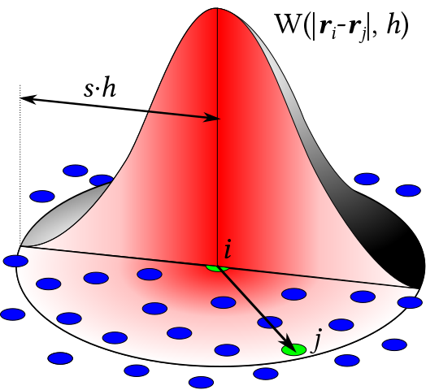

# 光滑粒子流体动力学SPH

## 目标

- 理解SPH的思想和计算过程
- 代码与解释（施工中...）

## SPH离散化的思想

光滑粒子流体动力学（SPH）的概念中，粒子携带两样东西来模拟连续的场：

1. 物理量
2. 核函数$W$

下式中，$A$可以任意空间分布的物理属性，例如密度、压力等等

$A(x)=\displaystyle\sum_iA_i\frac{m_i}{\rho_i}W(\mid\mid\textbf{X}-\textbf{X}_j\mid\mid_2,h)\quad(1)$

周围粒子的物理量，接近中间粒子的贡献越多，反之越小。

例如对一个粒子力的加权：

$f(r)=f(r)=\displaystyle\sum_jf(r_j)\frac{m_j}{\rho_j}W(\mid\mid\textbf{r}-\textbf{r}_j\mid\mid_2,h)$

SPH的空间积分只与核函数相关：

$\nabla f(r)\approx\displaystyle\sum_jf(r_j)\frac{m_j}{\rho_j}\nabla W(\mid\mid\textbf{r}-\textbf{r}_j\mid\mid_2,h)$

$\nabla\cdot \textbf{F}(r)\approx\displaystyle\sum_j\textbf{F}(r_j)\frac{m_j}{\rho_j}\nabla\cdot W(\mid\mid\textbf{r}-\textbf{r}_j\mid\mid_2,h)$

$\nabla\times \textbf{F}(r)\approx-\displaystyle\sum_j\textbf{F}(r_j)\frac{m_j}{\rho_j}\nabla\times W(\mid\mid\textbf{r}-\textbf{r}_j\mid\mid_2,h)$

$\nabla^2 f(r)\approx\displaystyle\sum_jf(r_j)\frac{m_j}{\rho_j}\nabla^2 W(\mid\mid\textbf{r}-\textbf{r}_j\mid\mid_2,h)$

总结：

> SPH中所谓的smoothed particle，并不是指一个在空间中携带了一系列物理量的粒子，而是值那个能对其周围进行采样的一个粒子（参见公式(1)）。它的核函数是光滑的。

## SPH的变种

- Weakly compressible SPH (WCSPH)，弱可压缩SPH，可以看成是显式格式的SPH
- Predictive-Corrective Incompressible SPH (PCI-SPH)，预测矫正不可压缩SPH，有点像隐式时间积分的SPH，但不完全是。它首先预测一下粒子的位置，再矫正一下，如此反复，从而得到一个比较好的速度场，这个速度场的散度比较小。速度场无散就意味着流体不可压缩。
- Position-based fluids (PBF)，基于位置的流体，是基于位置的动态(PBD)和SPH结合的一个产物，更多的应用于实时模拟流体。
- Divergence-free SPH (DFSPH)，强行实施不可压缩的一种方法。

## 弱可压缩SPH

### 系统公式

$\displaystyle\frac{Dv}{Dt}=-\frac{1}{\rho}\nabla p+(\nu\nabla^2v_i)+g\quad (2),\quad p=... \quad (3)$

公式$(2)$左边是粒子的加速度，右边是外力的加速度。其中：

> 液体压强的公式是$p=\rho gh$，密度$\rho$会影响压强

$\nabla p$ 是压强的梯度。压强的梯度会影响流体的速度。

$\rho$是密度，压强的梯度除以速度会得到一个加速度：$-\displaystyle\frac{1}{\rho}\nabla p$

$p$是压强，在WCSPH中，近似等于$p\approx B((\frac{\rho}{\rho_0})^{\gamma}-1)$，也有用$p=k(\rho-\rho_0)$。

$\rho_0$是理想密度。

$B$是模量，$\gamma$是常量(~7)

$\displaystyle\frac{Dv}{Dt}$是材料导数，可以理解为$v$是关于位置和时间的$v(x,t)$

### 密度公式

根据公式$(1)$，可以得到粒子的密度$\rho$都是由周围粒子的密度加权得来的：

$\rho_i=\displaystyle\sum_jm_jW(\mid\mid\textbf{X}_i-\textbf{X}_j\mid\mid_2,h)\quad(4)$

### 压强梯度公式

公式$(5)$是SPH里的一个算符。

教程里说这个公式不能由公式$(1)$推出来，但大家一直都还在用它，因为公式对称的，系统的动量守恒。

$\nabla A_i=\rho_i\displaystyle\sum_j m_j(\frac{A_i}{\rho_i^2}+\frac{A_j}{\rho_j^2})\nabla x_i W(\mid\mid \textbf{x}_i-\textbf{x}_j\mid\mid_2,h)\quad (5)$

### 计算过程

根据公式$(2)$，这里使用辛欧拉积分：

1. 对于每个粒子，计算密度$\rho_i$使用公式$(4)$
   - 密度：对于$i$粒子：$\rho_i=\displaystyle\sum_jm_jW(r_i-r_j,h)=\sum_jm_jW_{ij}$，求得$\rho_i$
2. 对于每个粒子，计算压强梯度$\nabla p$使用算子，也就是公式$(5)$
   - 粘度（可选）：$\nu\nabla^2v_i=\nu\displaystyle\sum_jm_j\frac{v_j-v_i}{\rho_j}\nabla^2W_{ij}$，非对称，得到粘度项$\nu\nabla^2v_i$。
   - 压强梯度项：$-\displaystyle\frac{1}{\rho}\nabla p_i=-\frac{\rho_i}{\rho_i}\sum_jm_j\left ( \frac{p_j}{\rho_j^2}+\frac{p_i}{\rho_i^2}\right )\nabla W_{ij}$，其中$p=k(\rho-\rho_0)$
3. 辛欧拉积分，就可以计算出：$\displaystyle\frac{dv_i}{dt}=-\frac{1}{\rho}\nabla p+\nu\nabla^2v_i+g$
   - 先更新速度$v_{t+1}=v_t+\Delta t \displaystyle\frac{dv_i}{dt}$
   - 再更新位置$x_{t+1}=x_t+\Delta t v_{t+1}$

这个计算过程和弹簧质点模型计算过程很像，只是这里不使用胡克定律。至此，这个计算就完成了，不过还少一个边界条件。

## 边界条件

有两种边界：

- 自由边界：例如空气
- 固体边界：例如容器壁

不管是自由边界还是固体边界，设定边界条件带来的问题，是对$i$粒子周围的采样不足。例如，当需要对$i$点对周围采样密度的时候$\rho_i=\displaystyle\sum_jm_jW_{ij}$，会试图去空气中或者固体容器壁采样，那里是采样不到的。这样会导致采样处的密度$\rho_i$下降，压强$p_i$也下降。

### 自由边界

自由边界采样减少，那么自由边界的粒子会“飞出去”，原因是自由边界外的“空气”没有（采集）压强。解决办法是生成自由边界外的压强。

最简单的一个办法是“阈值夹”，不允许粒子被“拉飞出去”，而只允许粒子被压缩。

那么相应的需要满足$p>0$，则：

$p=max(0, k(\rho-\rho_0))$

### 固体边界

问题依然是采样不足，但是，使用$p=max(0, k(\rho-\rho_0))$也不能完全解决问题，因为边界粒子的速度没有被限制住，粒子会“穿过”固体边界。有两种方法进行解决：

- 调整边界粒子速度
- 添加边界外粒子 padding

**调整边界粒子速度**

- 当粒子离固体边界有一个比如$h$的距离
- 在粒子到达$h$位置时，切向速度保持不变，对法向速度进行调整
  - 可以调成反向
  - 可以衰减
  - 也可以直接调成0

**添加边界外粒子**

边界外的一层粒子赋予密度和速度：

- 压强永远不变：$\rho_{solid}=\rho_0$
- 永远不动：$v_{solid}=0$

可能会带来一些“粘性”

## 时间步长条件

Courant-Friedrichs-Lewy (CFL) condition，做任何的显式时间积分，都需要考虑这个条件，其公式如下：

$C=\displaystyle\frac{u\Delta t}{\Delta x}\leq C_{max}～1$

$C$是CFL值，$\Delta t$是时间步长，$\Delta x$是长度间隔（例如粒子半径、网格尺寸），$u$是最大速度

公式中，$u\Delta t$可以看作是一个粒子在一个时间步可以移动的最大距离，除以$\Delta x$之后，取值在$0.1～10$之间（取决于仿真）否则就会数值爆炸。一般都取$1$左右。可以直观地理解为一个粒子在一个时间步移动的最大距离要约等于/小于仿真中的“最小距离”。也就是说，粒子不能运动太快了。

在图形学中，常见的$C_{max}$可以取：

- SPH: $～0.4$
- MPM: $0.3～1$
- FLIP fluid (smoke): $1～5+$

## 计算效率

说的就是搜索邻居的算法 Neighbourhood Search

SPH中的复杂度为$O(n^2)$，因为每次要对一个粒子$i$，对比所有粒子$j\neq i$的粒子的距离。这样开销太大。

在实践中，人们会建立一个$n\times n$的空间数据结构（例如voxel grid）来加速搜索，可以把复杂度减少到$O(n)$。一般在2D中3x3=9，在3D中3x3x3=27个格子。

近邻搜索一般都是SPH的瓶颈。

## 题外话

基于粒子的模拟方法：

- SPH族
- DEM (Particle-based simulation of granular materials)
- Moving particle Semi-implicit (MPS)：和SPH相近，在局部解泊松方程，让流体的不可压缩性更好。
- Power Particles: An incompressible fluid solver based on power diagrams
- A peridynamic perspective on spring-mass fracture

## SPH和刚体的耦合

> Interlinked SPH Pressure Solvers for strong fluid-rigid coupling

强耦合：流体和刚体联立求解

弱耦合：先解流体，再把流体作为边界条件解刚体，再把解出来的刚体作为边界条件解流体，循环往复。

## 学习资料

- [太极图形课S1第10讲：流体仿真 01](https://www.bilibili.com/video/BV1mi4y1o7wz?p=1&vd_source=b81ee13afebc577ab303e9f3baf5c0ed)
- [GAMES201：高级物理引擎实战指南2020 - 拉格朗日视角（1）](https://www.bilibili.com/video/BV1ZK411H7Hc?p=2&vd_source=b81ee13afebc577ab303e9f3baf5c0ed)