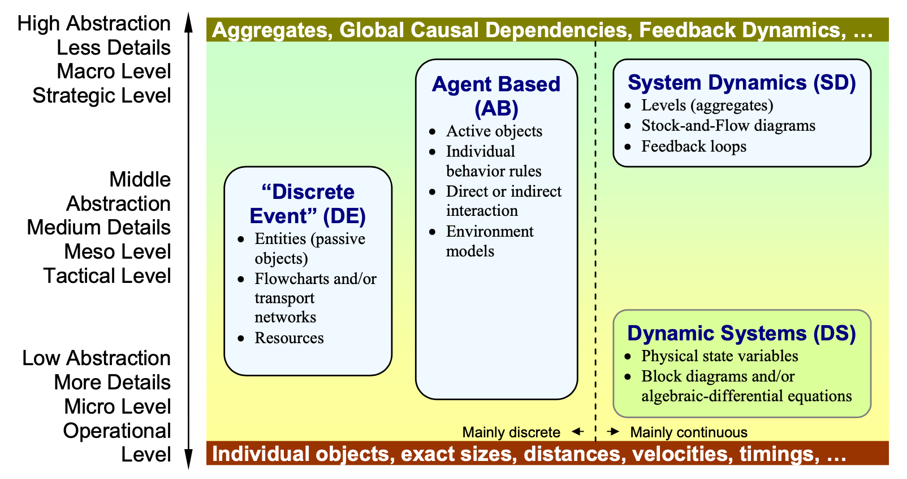
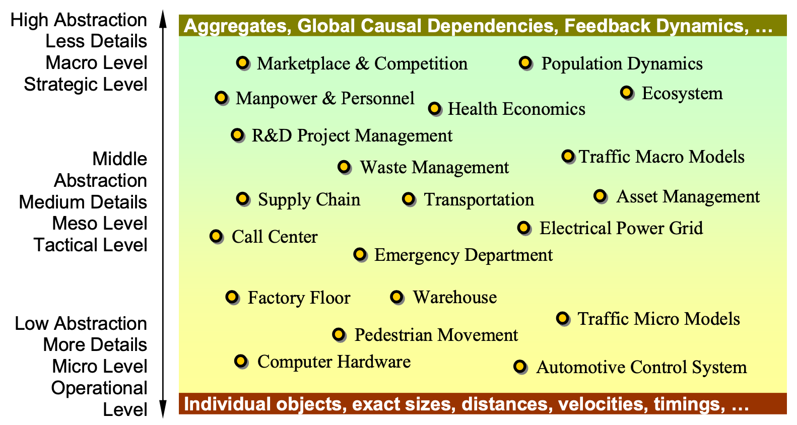

# 模拟仿真

由于模拟仿真的概念过于庞大，经常有概念混淆和不理解的困扰。

最近读到一篇论文，对模拟仿真这个巨大的主题做了分类，感觉挺有帮助的。论文是在anylogic的网站上找到的：[From System Dynamics and Discrete Event to Practical Agent Based Modeling: Reasons, Techniques, Tools](https://www.anylogic.cn/resources/articles/from-system-dynamics-and-discrete-event-to-practical-agent-based-modeling-reasons-techniques-tools/)

## 仿真建模主要范式

**Fig. A** 仿真建模中的主要范式

### 系统动态学 (SD)

- 旨在模拟抽象度高的、连续的系统
- 直观的理解，可以显式地表达为Stock-and-Flow的图表
- 重要的一环是Stock-and-Flow中的反馈环路，使得系统具有动态性

### 离散事件 (DE)

- 模拟对象就是离散事件，抽象度居中
- 具有离散事件的实体、实体所在的环境、流程图/网络、资源等
- 一般都有时钟
- p.s. 某些场景下也可以使用有限状态机FSM来实现相同的功能

### 基于智能体 (AB)

- 根据任务目标可以设置不同抽象度
- 每个智能体agent是独立的，也是互相关联的
- 行为规则/学习目标

### 动态系统 (DS)

- 抽象层级低，针对的问题基本都是连续的
- 系统的物理状态
- 用微分方程描述的系统

## 模拟仿真应用例子

应用的例子如图B，所有的应用都可以理解为仿真，但是其仿真建模之间的区别很大。

例如图形学中的CFD、工程中的FEM，它们模拟的对象是连续介质的微观层面，有位置、时间、场的引入，是关于物理量本身的模拟仿真。而工厂和生产线的OEE、流程和成本的建模，涉及离散事件/流程的属性，以及通过流程关系和环境交互，最终仿真出离散系统的效果呈现，属于中等直观层面的模拟仿真。供应链的模拟也一样。市场竞争和人口动态学接触较少。

**Fig. B** 模拟仿真的一些应用举例