# 键合图

## 目标

- 了解键合图是什么
- 了解键合图的基本要素

## 介绍

在工程系统中，当能量以一种形式向另一种形式转换时，所有的系统都共享一套在其组建间传输和分布能量的物理现象。根据热力学第一定律，系统的总能量保持不变。1959年，Henry Paynter使用了热力学第一定律和系统通用特性，创建了一种分析和建模多领域工程系统的通用的图方法，即键合图（BG）

键合图通过图建模来表达一个系统。针对一个双向的能量/动力交换，键合图方法给每个系统组件指定端口（通信点），并通过键（通信路径和方向）来连接端口和邻接组件。每个组件接收/发送一个数量的effort（势），并且同时发送/接收另一个数量的flow（流）。势和流的乘积为功率，或者说是能量变化率。举例：在机械系统中，力是effort，速度是flow；在电气系统中，电压是effort，电流是flow。键的集合，包括相关的系统组件本构规则、约束和边界条件，组成了系统的BG模型。构建一个BG模型需要求9个基本元素，它们可以构建表达系统动态行为的BG模型。构建出的BG模型可以清楚地展示系统的运动学（flow的连续流）和动力学（effort的连续流），并且可以用来提取出描述系统动态行为的方程。

> 功率可以理解为单位时间内物体做功或能量变化的快慢

系统的行为随着时间变化，所以BG模型中最关心的就是能量/功率的时间变化率。能量$\varepsilon$和功率$p$ 的关系为：

$P(t)=\displaystyle\frac{\varepsilon (t)}{dt}\quad or\quad \varepsilon(t)=\int P(tdt)$

根据热动力学，系统能量的总变化等于做的功 $W$ 和热量 $Q$ 的和：

$d\varepsilon=Pdt=\delta W+\delta Q$

**概念区分**

Kinetics(physics & engineering)强调运动和导致运动原因之间的关系。尤其是，力与力矩（forces and torques）。在物理学课本（理论界）中，analytical dynamic已经取代了kinetics，但是在工程领域，还是经常能看到kinetics这个单词。

Dynamic强调“力“， 要追究运动背后的driving force，即研究运动与“力”的关系，基本所有dynamic的方程的出发点都是牛顿定律，如F=ma，等式的一边是力F，另一边是运动速度v或加速度a，可以把dynamic看成牛顿定律的推广。研究动力学问题必须知道系统的拉格朗日量或者哈密顿量。一些对时间的微分方程我们也经常称之为dynamic system(动力系统)。

Kinematics强调”运动“，是经典力学的一个分支，在研究的过程中不考虑是什么原因（也就是不考虑力）导致了运动。运动学研究的过程就是测量和计算运动量（kinematic quantities）并用来描述运动的过程。运动量包括：速度，加速度，位移，时间，和轨迹。

## 图的区别

键合图是物理动态系统的一个图形表示，它可以将系统转换到一个状态空间表达。它和块图（block diagram）/信号流图（signal-flow graph）很相似，但主要的区别在于键合图中的弧线表示物理能量的双向交换，块图和信号流图则只表达单向的信息流。

## 因果性

根据参考资料**[Bond Graph]**，键合图的一大特征就是因果性。在建模时需要在端口（ports）间指定其因果性（信息流方向）。

所以键合图到底可不可以做非因果建模？

## 多物理系统

BG建模方法中与不同系统相关的模拟量和单位：

| Systems                              | Effort (e)                          | Flow (f)                             | Displacement ($q=\sum fdt$) | Momentum ($p=\int edt$)              |
| ------------------------------------ | ----------------------------------- | ------------------------------------ | --------------------------- | ------------------------------------ |
| 机械平移 mechanical-translational    | 力 force [牛 $N$]                   | 速度 velocity [$m/s$]                | 距离 distance [$m$]         | 动量 momentum [$kg.m/s$]             |
| 旋转机械 Rotational mechanical       | 扭矩 torque [$N.m$]                 | 角速度 angular velocity [$rad/s$]    | 角度 angle [$rad$]          | 角动量 angular momentum [$kg.m^2/s$] |
| 液压 hydraulic                       | 压强 pressure [$Pa$]                | 体积流率 volume flow rate [$m^3/s$]  | 体积 volume [$m^3$]         | 液压动量 hydraulic momentum [$Pa.s$] |
| 热学 thermal / 热力学 thermodynamics | 温度 temperature [$K$]              | 熵变化 entropy change [$J/K.s$]      | 熵 entropy [$J/K$]          | -                                    |
| 热流体 thermo-fluid                  | 焓 enthalpy (specific) [$J$]        | 质量流率 mass flow rate [$kg/s$]     | 质量流 mass flow [$kg$]     | flow momentum                        |
| 电学 electrical                      | 电压 voltage [$V$]                  | 电流 current [$A$]                   | 电容 charge [$C$]           | flux linkage [$V.s$]                 |
| 电磁学 magnetics                     | 电磁力 magnetic force [$A$]         | 磁通量率 magnetic flux rate [$Wb/s$] | 磁通量 magnetic flux [$Wb$] | -                                    |
| 化学 chemical                        | 化学能 chemical potential [$J/mol$] | 摩尔流率 mole flow rate [$mol/s$]    | 摩尔流量 mole flow [$mol$]  | -                                    |

## 九个基本元素

构建一个物理系统的BG模型需要考虑系统中的能量保存、传输和转换。

- 对于能量储存，考虑两个元素：动力学中的惯性元素 $I-Element$ 和势能元素的 $C-Element$ 的能量储存。

- 对于能量关于，考虑一个元素：摩擦或者电阻元素 $R-Element$ 

- 对于能量源汇，在系统的边界上由两个元素表示：势 $S_e$ 和流 $S_f$

- 对于能量分布，管理系统中的能量分布定义两个元素作为结点，$junction1$ 和 $junction0$

- 对于能量传输/转换，转换元素 $TF-Element$ (transformer)和回转元素 $GY-Element$(Gyrator)

对于上述每一个BG元素，都有一个由数学模型表达的本构关系。

例如一个线性机械弹簧由势能元素$C$表达，它的方程需要遵循胡克定律。然而，一个弹簧的形变可以由受到一个effort引起，例如受到力；也可以由受到一个flow引起，例如速度。我们可以使用表达因果的图线（causality strokes）来表达因果分配（causality assignment）。需要对BG模型的每一个点都应用因果分配。

一个例子：

- R-Element (damper)
- C-Element (spring)
- I-Element (mass)
- TF-Element (lever)
- GY-Element (gyroscope)

### 惯性元素I - 动能储存

$I-Element$ 是一个被动元素，它接受一个输入，返回一个信号。只有一个端口连接系统。

机械系统中，质量体是一个$I$元素；电气系统中，电感器是一个$I$元素。

下图中倾向于使用左侧的方式，即接受$e$并积分，然后发送$f$，effort-in，积分因果。

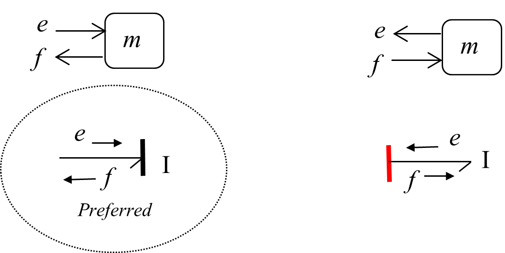

根据牛顿定律，数学上的表达为：$F=m\displaystyle\frac{dv}{dt}=m\dot v$，其中，$F$是受到的力，$v$是$I$元素的速度。

BG模型的记号为：$e=I\displaystyle\frac{df}{dt}=I\dot f$，其中，输入为$\displaystyle\frac{e}{I}$，输出为$\dot f$，输入等于输出：$\dot f=\displaystyle\frac{e}{I}$，公式是一阶ODE。

对两边积分得到$\displaystyle\int \dot fdt=\frac{1}{I}\int edt$，其中，力对时间的积分为动量$\displaystyle\int edt=P$

可以得到$f=\displaystyle\frac{P}{I}$

根据上式，速度等于动量除以质量，虽然这一点很明确，但是在BG模型中，从物理的角度来理解更为重要：

> effort的积分收集了所有的输入数据

下图左边是块图的表达（block diagram），右边是BG的表达。

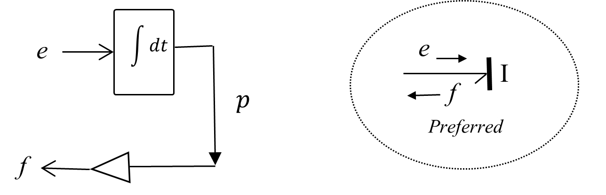

总之，$I$元素在BG模型中的本构方程为：

$f=\displaystyle\frac{P}{I}=\frac{1}{I}\int edt$

其中，$\displaystyle\int edt=P$ 这一项叫做状态变量（state variable）

### 势能元素C - 势能储存元素

$C-Element$ 是一个被动元素，它接受一个输入，返回一个信号。只有一个端口连接系统。

机械系统中，弹簧是一个$C$元素；电气系统中，电容是一个$C$元素。

下图中倾向于使用右侧的方式，即接受$f$，然后发送$e$并积分，effort-out，积分因果。

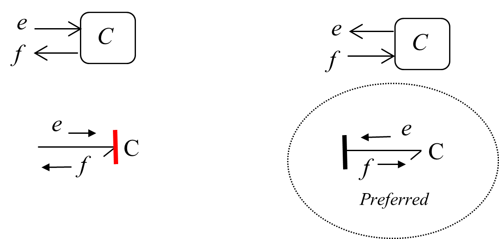

举一个弹簧的例子：$F=kx=k\displaystyle\int vdt$，其中，$k$是弹簧刚度。

BG模型的记号为$e=kq=\displaystyle\frac{q}{c}=\frac{1}{c}\int fdt,\ c=\frac{1}{k}$

其中，$\displaystyle\int fdt$ 为状态变量

### 摩擦元素R - 能量耗散元素

$R-Element$ 是一个被动元素，它接受一个输入，返回一个信号。只有一个端口连接系统。

机械系统中，阻尼器是一个$R$元素；电气系统中，电阻是一个$R$元素。

下图显示，$R$元素的输入可以是effort，也可以是flow。

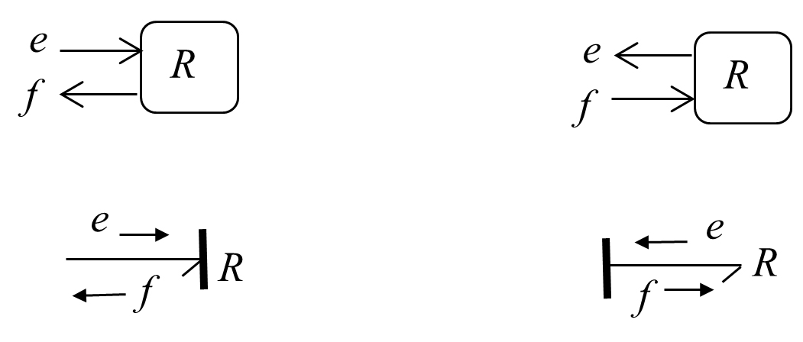

举一个摩擦力的例子，$F=Rv$，其中，$R$为阻尼系数。

BG模型的记号为：$e=Rf$

$R$元素的本构方程：

- 如果是effort-in，那么$f=\displaystyle\frac{e}{R}$

- 如果是effort-out，那么$e=Rf$

### 源元素Se/Sf - 边界输入元素

下图分别为effort-in和flow-in在BG模型中的符号表达

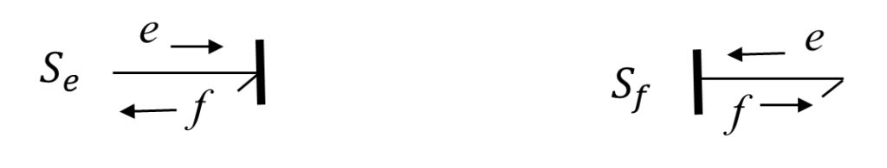

### 1- 和0-节点 - 分布约束元素

在BG模型中，系统中约束能量分布的两个元素$1$和$0$节点元素，它们有多个端口。

下图是一个$1-junction$元素，它可以是一个流均衡器（flow equalizer），也可以是一个势收集器（effort summator）组件。

1为强键，$1-junction$元素分配来自强键的flow，它符合：

$\left \{\begin{aligned}&f_1=f_2=...=f_N\\&\sum_{i=1}^Ne_i=0\end{aligned}\right.$

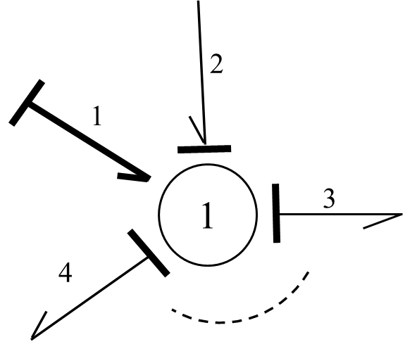

下图是一个$0-junction$元素，它可以是一个流均衡器（flow equalizer），也可以是一个势收集器（effort summator）组件。

1为强键，$0-junction$元素分配来自强键的effort，它符合：

$\left \{\begin{aligned}&e_1=e_2=...=e_N\\&\sum_{i=1}^Nf_i=0\end{aligned}\right.$

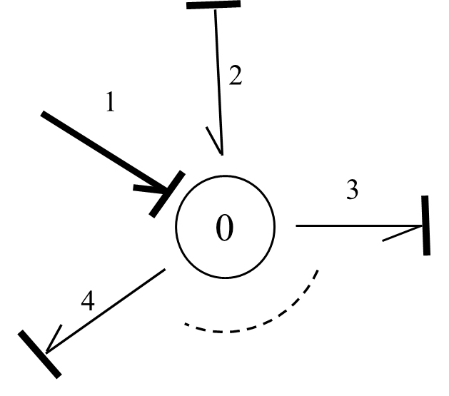

### 转换元素TF和转变元素GY - 能量转换元素

在物理工程系统中，能量可能由一些组件转换成另一种，但同时保持能量不变。它们有两个端口，输入端口输入一个量，输出端口输入转换后的量。机械系统中，杠杆和齿轮箱是转换元素$TF$；电气系统中，变压器和发动机为转换元素$TF$。

转换元素$TF$的输入和输出物理量类型相同，入下图，$TF$接受一个effort和一个flow输入，输出一个转换后的effort和flow。当然，转换参数$\lambda$需要事先定义好，

如果$f_1$作为输入，$f_2$作为输出，可以写成$f_2=\lambda f_1$。基于总能量不变，$e_1f_1=e_2f_2$，输出的effort为：$e_1=(f_2/f_1)e_2=\lambda e_2$。

同理，如果$e_1$作为输入，$e_2$作为输出，可以写成$f_1=\lambda^{-1}f_2$

 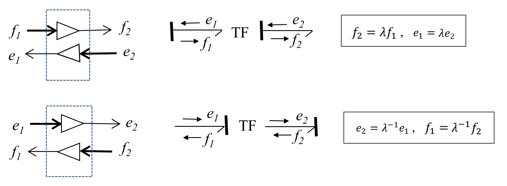

转变元素$GY$的输入是一类物理量，输出则是另一类物理量。

同上，如果$f_1$作为输入，$f_2$作为输出，则$f_2=\kappa f_1$

同理，如果$e_1$作为输入，$e_2$作为输出，可以写成$f_1=\kappa^{-1}f_2$

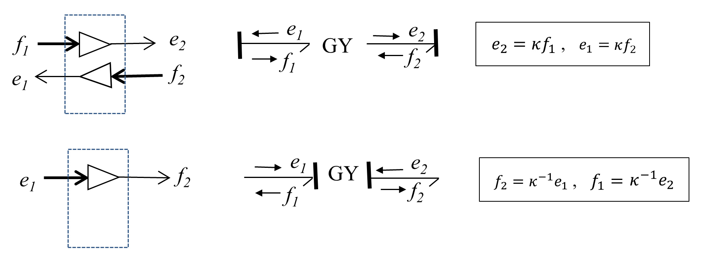

## 系统状态变量

BG模型的最终目的是求解系统方程，系统方程可能是二阶或者二阶以上的ODE。然而，当我们针对状态变量（state variables）来写方程时，我们会得到一个一阶ODE。状态变量唯一地、充分地对系统动态进行了描述。

当我们从BG模型抽取系统方程时，也会涉及额外的代数方程。所以，我们会得到一个系统的微分代数方程（DAE），好处是ODE为一阶。

### 惯性元素I状态变量

惯性元素$I$的总能量可以写成元素的功率对时间的积分：$\displaystyle\int f\cdot edt=\int(edt)f$，鉴于effort与时间的乘积为动量：$edt=dp$，可以得到$\displaystyle\int(edt)f=\int fdp$，也就是说，惯性元素的总能量是flow将动量$p$作为状态变量的积分。

根据牛顿第二定律，$f=\displaystyle\frac{p}{I}$，那么总能量：

$Energy=\displaystyle\frac{1}{I}\int pdp=\frac{p^2}{2I}$

上式表明，储存在惯性元素$I$中的总能量，唯一地由其动量$p$决定，即广义动量（generalized momentum）。

如下图所示，求解的步骤为：

1. 确定BG模型中的$I$元素输入和输出，图中输入为力（effort）
2. 计算状态变量，图中为计算$I$元素的动量$p$
3. 根据物理规则计算输出，图中为牛顿第二定理，计算得到输出速度为$f=\displaystyle\frac{p}{m}$

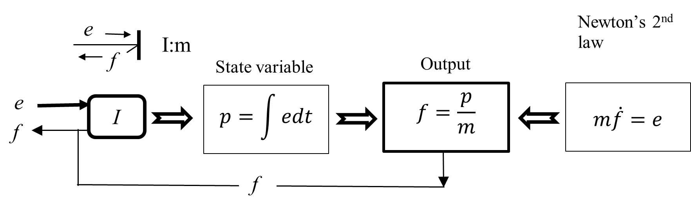

### 势能元素C状态变量

和惯性元素一样计算，可以得到

$Energy=\displaystyle\frac{q^2}{2c}$，$q$为广义的位移变化

上式表明，储存在势能元素$C$中的总能量，唯一地由其位移$q$决定，即广义位移（generalized displacement）

如下图所示，求解的步骤为：

1. 确定BG模型中的$C$元素输入和输出，图中输入为速度（flow）
2. 计算状态变量，图中为计算$C$元素的位移$q$
3. 根据物理规则计算输出，图中为胡克定律，计算得到输出速度为$e=\displaystyle\frac{q}{c}$

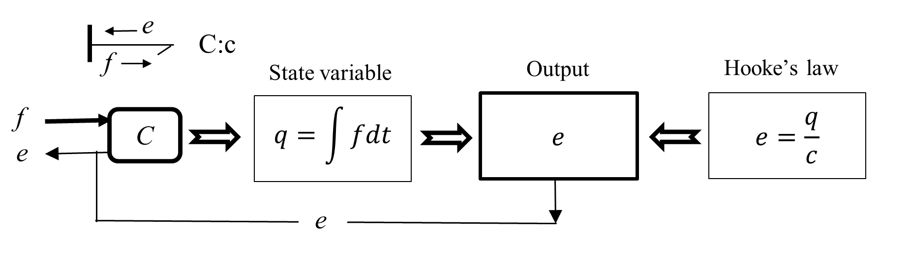

## 学习资料

- [3 Bond Graph Modelling Method](https://pressbooks.bccampus.ca/engineeringsystems/chapter/bond-graph-modelling-method/)
- [Bond Graph](https://handwiki.org/wiki/Bond_graph)