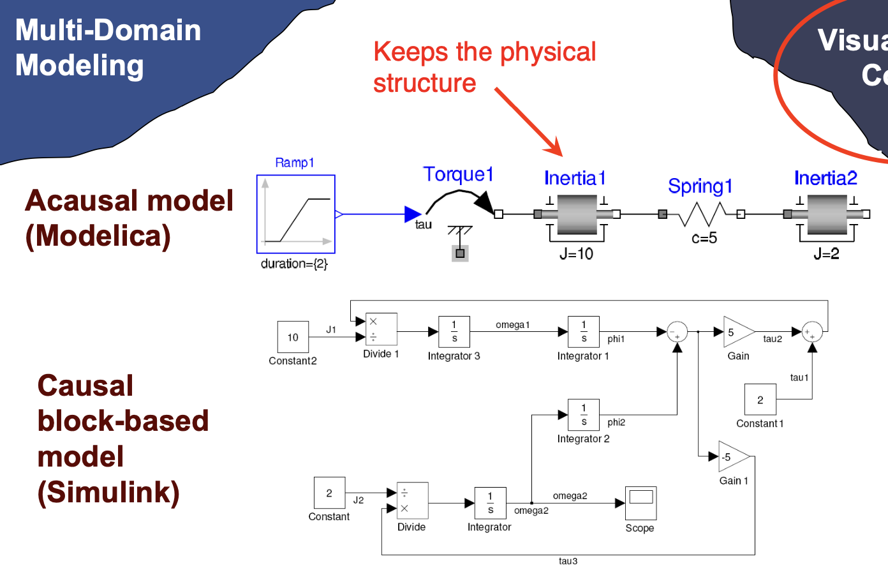
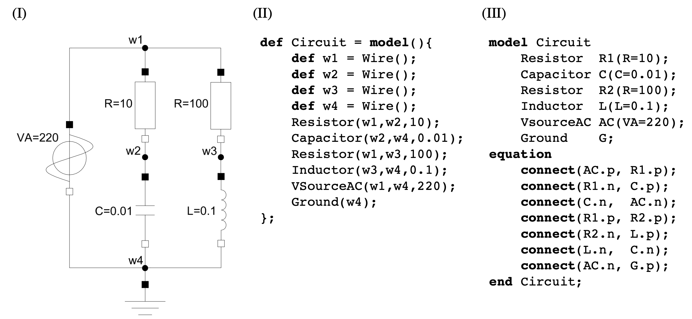

# 系统动态建模仿真

## 建模仿真语言

- 离散时间/事件仿真：一般通用语言都能应对，例如C++
- 连续时间仿真：通用语言无法应对，有专门的工具和语言
  - 支持块图/输入/输出的定义，例如Simulink
  - 支持混合DAE建模连续和离散行为，例如Modelica、Omala、VHDL-AMS等

## EOO和模型

面向对象编程语言（Object-oriented programming language）中类的行为是通过所定义的方法进行描述的，而基于公式的面向对象语言（Equation-based object oriented language - EOO）中，连续时间行为通过微分代数方程（DAE）进行描述，离散时间行为通过生成事件的结构体进行描述。这些行为被打包成抽象，叫做类/模型（Modelica），或者叫做实体和架构（VHDL-AMS）。

模型本身是类，模型是生成模型实例（Modelica中叫做组件）的蓝图。模型中有定义良好的接口（interfaces），包括许多端口（ports）或者叫做连接器（connectors）。

## 因果和非因果模型

在参考资料**[High-Order Acausal Models]**中，EOO语言的一个典型特性是，模型实例之间的连接是非因果的（acausal）。在这里，非因果的意思是，模型实例之间的信息流方向没有在建模时定义。在EOO的语境下，对非因果模型做如下定义：

> 一个非因果模型是一个封装和构成如下内容的抽象：
>
> 1. 以DAE形式表达的连续时间行为
> 2. 其他关联的非因果模型，其子模型之间的信息流未被定义

以上是对非因果模型的定义，那参考键合图中构建的因果关系模型，我对因果和非因果模型区别的理解为：

> 针对一个给定的系统场景，因果模型在建模时，会先理解其物理系统，在建模时九江信息/物理量流动的前后/因果关系建好模。而非因果关系建模，是在预先定义好通用的模型的情况下，在建模时不定义物理系统中信息/物理量的流动。很明显，前者会建好一个给定场景的固定模型，而后者对该物理系统可能需要的拓扑则更加方便灵活。

在参考资料**[Equation-based object-oriented languages for acausal modeling and simulation]**中（Modelica的资料），因果和非因果模型的区别如下所示：

非因果模型建模时不定义方向，因果模型（基于块的模型）在建模时指定方向。

## EOO语言工具流程

如下图示，整个流程分为编译时和运行时：

- 在编译时，用户构建好EOO模型以后，由混合DAE表达，DAE在此时进行转换生成代码
- 在运行时，通过生成的代码执行仿真

## 高阶EOO语言

参考资料**[High-Order Acausal Models]**展示了一种对比Modelica建模的方法，(I)是系统案例图，(II)是它提出的MKL（Modeling Kernel Language）建模语言，(III)是Modelica的建模语言。

MKL中提到所谓的高阶，就是利用可将函数作为“一等公民”的编程语言特性（函数可以作为传递值和返回值），将模型/方法/函数一层一层包裹，并且利用匿名函数，隐式地声明模型中的组件关系。对比(III)的Modelica建模，需要显示地声明connect公式。

## 学习资料

- [High-Order Acausal Models](https://ep.liu.se/ecp/029/007/ecp08029007.pdf#:~:text=An%20acausal%20model%20is%20an%20abstraction%20that%20encapsulates,where%20the%20direc-%20tionof%20information%EF%AC%82ow%20betweensub-modelsis%20notspec-%20i%EF%AC%81ed.)
- [Equation-based object-oriented languages for acausal modeling and simulation](https://ptolemy.berkeley.edu/projects/embedded/eecsx44/lectures/Spring2013/modelica-dae-part-1.pdf)